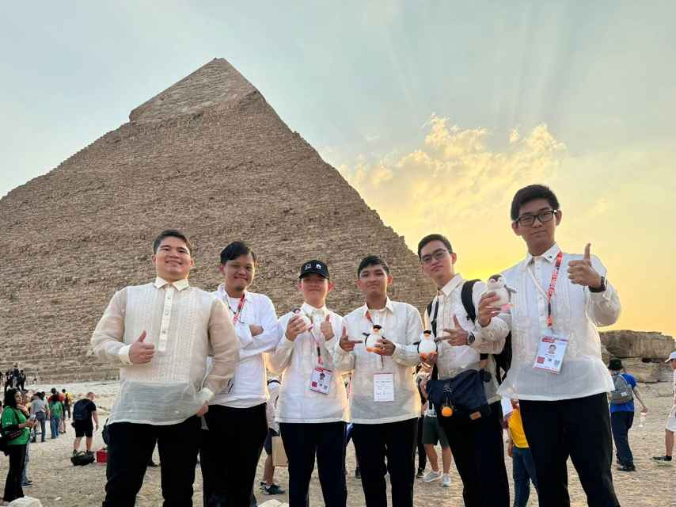
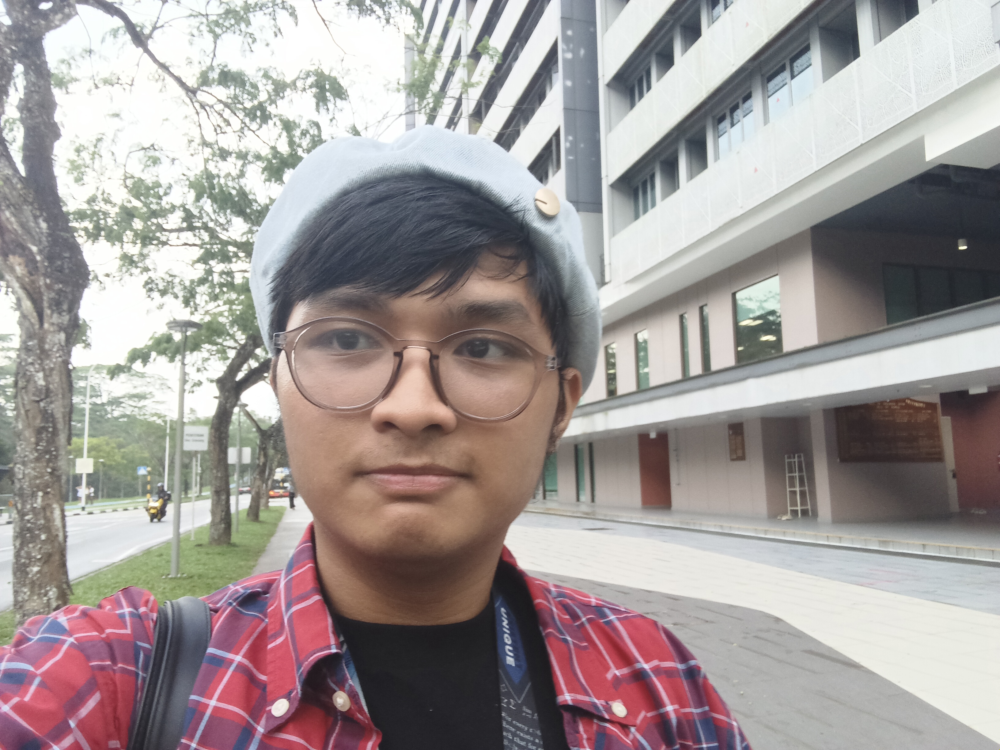
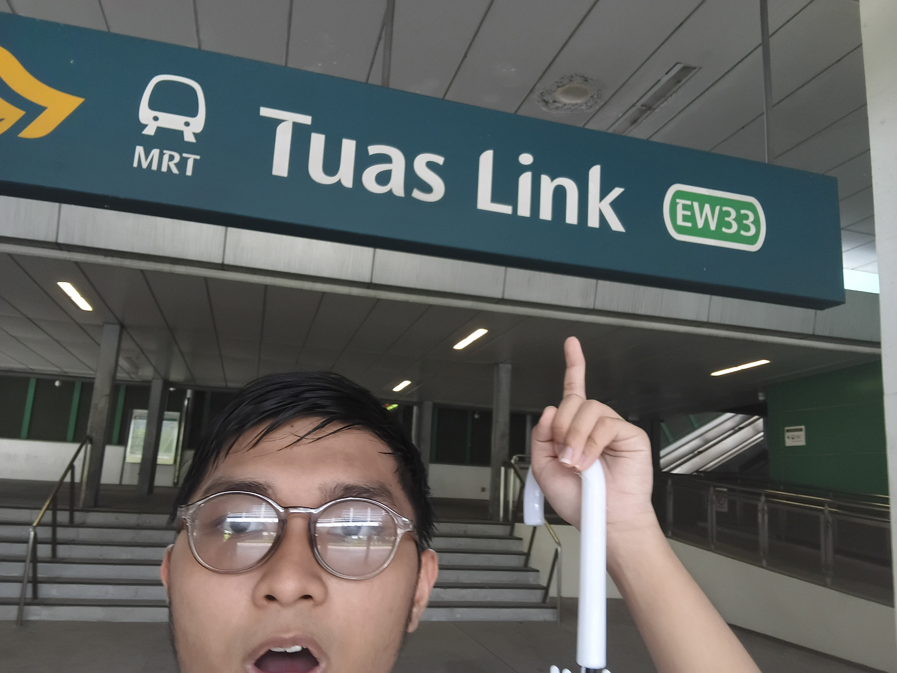

Hello! I'm **Gabee De Vera**, commonly known on the internet as *"ProtonDecay314"*. I'm a Filipino competitive programmer and contest mathematician. I participated in the 2024 International Olympiad in Informatics hosted in Egypt.

I'm the third from the right in the picture above.

Now, I am studying a double major in Mathematical and Computer Sciences (MACS) at Nanyang Technological University in Singapore.

I'm an avid lover of public transport (especially trains). When I'm not studying or preparing for the [ICPC](https://icpc.global/), you can find me exploring random places with public transport. And when I say random, I mean random! [Tuas Link](https://maps.app.goo.gl/uXR3ozTm7EPUaHwW8), anyone?

On school breaks, I'm also a Project Sekai player (during school terms, I get too busy for it).

If you're interested in competitive programming or simply willing to read about a nerd's ramblings, you are in the right place! I hope you enjoy your stay!

Well, enough about me. Start reading the blog [here]({{site.baseurl}}/)!

---

## Connections
- Instagram: [@ProtonDecay314](https://www.instagram.com/protondecay314/), [@harukapenchickdoesthings](https://www.instagram.com/harukapenchickdoesthings/)
- GitHub: [RedBlazerFlame](https://github.com/RedBlazerFlame)
- LinkedIn: [Hans Gabriel De Vera](https://www.linkedin.com/in/hans-gabriel-de-vera/)